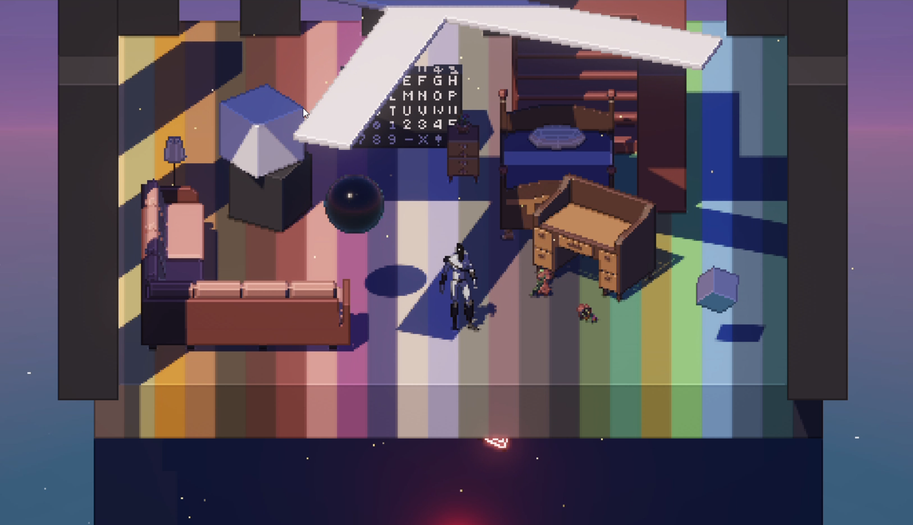
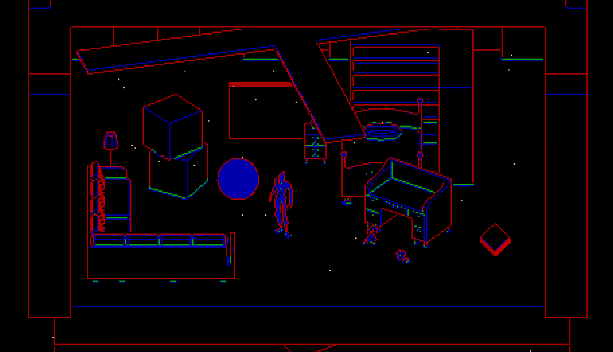

Ce projet utilise Unity 6000.0.38f1.
Ce projet utilise des assets de l'Asset Store Unity. Ces assets ne sont pas contributoires au défi technique accompli.

Le shader d'edge detection utilise des fonctions de calcul de courbature provenant d'un repo GitHub de federicocasares:
https://github.com/federicocasares/cavifree

### Preview de la scène principale avec le shader d'edge detection activé

### Preview de la scène avec uniquement le shader d'edge detection

[//]: # (### Vidéos de démonstration)

[//]: # ()
[//]: # (#### Caméra stable, sans jtter)

[//]: # ([anti-jitter-camera-motion.mp4]&#40;Preview/anti-jitter-camera-motion.mp4&#41;)

[//]: # ()
[//]: # (#### Rotation de la caméra orthographique)

[//]: # ([camera-rotation.mp4]&#40;Preview/camera-rotation.mp4&#41;)

[//]: # ()
[//]: # (#### Changement de l'angle de l'illumination)

[//]: # ([lighting-change.mp4]&#40;Preview/lighting-change.mp4&#41;)